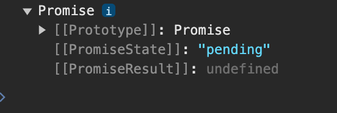
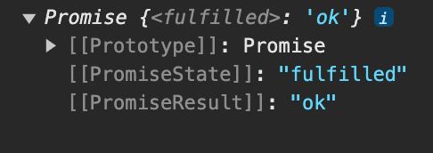
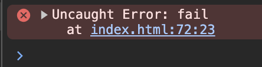

## 异步状态

`Promise` 可以理解为承诺，就像我们去 KFC 点餐服务员给我们一引取餐票，这就是承诺。如果餐做好了叫我们这就是成功，如果没有办法给我们做出食物这就是拒绝。

- 一个 `Promise` 必须有一个`then`方法处理状态改变

#### 状态说明

Promise 包含`pending`、`fulfilled`(被履行)、`rejected`三种状态

- `pending`指初始等待状态，初始化`promise`时候的状态
- `resolve`指已经解决，将`promise`状态设置为`fulfilled`
- `reject`指拒绝处理，将`promise`状态设置为`rejected`
- `promise`是生产者，通过`resolve`和`reject`函数告知结果
- `promise`非常适合需要一定执行时间的异步任务
- 状态一旦改变就不可更改

promise 没用使用`resolve`和`reject`的时候状态是`pending`

```
const p = new Promise((resolve,reject) => {

})
console.log(p)
```



当更改状态后

```
const p = new Promise((resolve,reject) => {
	resolve('ok')
})
console.log(p)
```



`promise`创建时即执行同步任务，`then`会放在异步微任务中执行，需要等同步任务执行完成后才执行

```
const p = new Promise((resolve,reject) => {
	resolve('ok')
	console.log('resolve')
})
p.then(res => {
	console.log(res)
})
console.log('script end')

# resolve
# script end
# ok
```

`promise`代码都是在其他代码执行之后执行

- `promise`的then、catch、finally的方法都是异步任务
- 程序需要将主任务执行完成后才会执行异步队列任务

```
const p = new Promise((resolve, reject) => {
    resolve('success')
})
p.then(alert)
alert('1')
p.then(() => {
    alert('2')
})
# 1
# success
# 2
```

下例在三秒后将`Promise`状态设置为`fulfilled`，然后执行`then`方法

```
new Promise((resolve, reject) => {
	setTimeout(() => {
		resolve('fulfilled')
	}, 3000)
}).then(
	msg => {
		console.log(msg)
	},
	error => {
		console.log(error)
	}
)
```

状态被改变后就不能再修改了，下面先通过`resolve`改变为成功状态，表示`Promise`状态已经完成了，就不能再使用`reject`更改状态了

```
  new Promise((resolve, reject) => {
  	resolve('fulfilled')
  	reject('失败')
  }).then(
  	msg => {
  		console.log(msg)
  	},
  	error => {
  		console.log(error)
  	}
  )
```

#### 动态改变

下例中`p2`返回了`p1`所以此时p2状态已经无意义了，后面的`then`是对`p1`状态的处理

```
const p1 = new Promise((resolve, reject) => {
	resolve('fulfilled')
})
const p2 = new Promise(() => {
	resolve(p1)
}).then(
	res => {
		console.log(res)
	},
	error => {
		console.log(error)
	}
)
```

## then

一个Promise需要提供一个`then`方法访问`promise`的结果

- `then`方法必须返回`promise`，用户返回或者系统自动返回
- 第一个参数在`fulfilled`状态执行，即在`resolve`的时候`then`第一个函数处理成功状态
- 第二个参数在`rejected`状态执行，即在`reject`的时候`then`第二个函数处理失败状态，该函数为可选的，也可以用`catch`来处理失败的状态

```
let p1 = new Promise((resolve, reject) => {
	reject('rejected')
})
.then()
// .then(null, (f) => console.log('f',f)) //和catch都可以处理失败状态只存在一个即可
.catch(e => console.log('e',e))
```


- 两个函数都接收`promise`传出的值做为参数

```
promise.then(onFulfilled, onRejected)
```

#### 链式调用

`then`是对上个`promise`的处理，每个`then`都是全新的`promise`，默认传递`fulfilled`状态，不要认为上一个 `promise` 状态会影响以后 `then` 返回的状态

```
new Promise((resolve, reject) => {
  reject();
})
.then(
  resolve => console.log("fulfilled"),
  reject => console.log("rejected")
)
.then(
  resolve => console.log("fulfilled"),
  reject => console.log("rejected")
)
.then(
  resolve => console.log("fulfilled"),
  reject => console.log("rejected")
);

# 执行结果如下
  ejected
  fulfilled
  fulfilled
```

## catch

catch 用于失败状态的处理函数，等同于 `then(null,reject){}`

- 建议使用 `catch` 处理错误
- 将 `catch` 放在最后面用于统一处理前面发生的错误

`catch` 可以捕获之前所有 `promise` 的错误，所以建议将 `catch` 放在最后。下例中 `catch` 也可以捕获到了第一个 `then` 返回 的 `promise` 的错误。

```
new Promise((resolve, reject) => {
  resolve();
})
.then(() => {
  return new Promise((resolve, reject) => {
    reject(".then ");
  });
})
.then(() => {})
.catch(msg => {
  console.log(msg);
});
```

下面的在异步中`throw`将不会触发`catch`，而使用系统错误处理

```
const promise = new Promise((resolve, reject) => {
   setTimeout(() => {
      throw new Error('fail')
   }, 2000)
}).catch((msg) => {
   console.log(msg + '后盾人')
})
```



但是如果不在异步里面的catch是可以捕获到的

```
const promise = new Promise((resolve, reject) => {
   throw new Error('fail')
}).catch((msg) => {
   console.log(msg + 'test')
})

# 返回 fail：test
```

## finally

无论状态是`resolve` 或 `reject` 都会执行此动作，`finally` 与状态无关

```
const promise = new Promise((resolve, reject) => {
  reject("fail")
})
.then(msg => {
  console.log("resolve")
})
.catch(msg => {
  console.log("reject")
})
.finally(() => {
  console.log("resolve/reject状态都会执行")
});
```

## 实例操作

