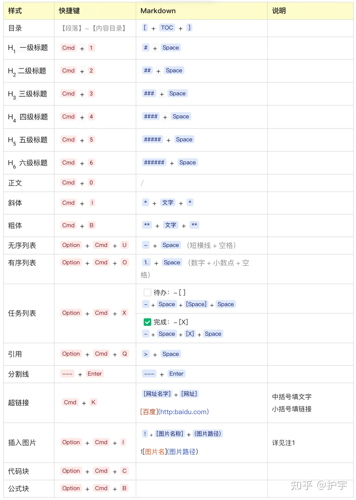

### Markdown 快捷键

**插入表格**：`option` + `command` + `T`

**无序号**：`-`  或 `*`

**有序号**： 阿拉伯数字后加上 `.` 后直接 ”空格“

**退出 序号 状态**：”按两次回车键“，或按  `command` + `[`

**插入超链接**：`command`  + `K`

**文本加粗**：`command`  + `B`

**文本斜体**：`command`  + `I`

**文本下划线**：`command`  + `U`

**删除线**：`control`  + `shift`  +  **`**（tab键上面的那个键）

**文本加粗、文本斜体、文本下划线、删除线**，可以随意**组合叠加**使用

**标题**：`command` + `1`  ；`command` + `2` ……；`command` + `7`

**段落（正文）**：`command` + `0`

**水平分割线**： 3个或3个以上的  `-`

**代码模块**：`option` + `command` + `C`

**公式模块**：`option` + `command` + `B`

**单个代码**：`control`  +   **`** （tab键上面的那个键）

**插入图片**：`control`  + `command`  + `I`

**注释**：`control`  +  `-`

### [画图](https://mermaid.js.org/intro/getting-started.html)

